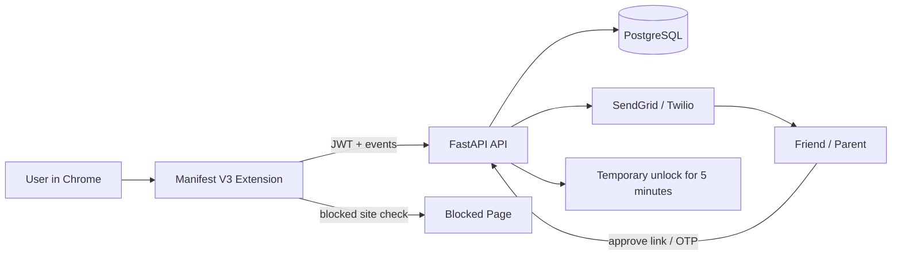

# FocusGuard

FocusGuard is a production-oriented browser extension plus FastAPI backend for blocking distracting websites with accountability approvals from a friend or parent.

## Architecture



## Repository Layout

```text
extension/
  manifest.json
  popup.html
  popup.css
  blocked.html
  src/
    background.ts
    content.ts
    popup.ts
    api.ts
    shared.ts

backend/
  app/
    api/
    core/
    db/
    models/
    schemas/
    services/
  requirements.txt
  Dockerfile
  sql/schema.sql
```

## PostgreSQL Schema

The canonical schema is in [backend/sql/schema.sql](backend/sql/schema.sql). It includes:

- `users`
- `blocked_sites`
- `friends`
- `block_attempts`
- `approval_requests`

## API Endpoints

Public routes are exposed at the root of the FastAPI app.

- `POST /register`
- `POST /login`
- `POST /add-blocked-site`
- `POST /remove-blocked-site`
- `POST /log-attempt`
- `POST /send-approval`
- `POST /approve-access`
- `GET /weekly-report`

## Extension Flow

1. The popup stores the JWT in `chrome.storage.local`.
2. `background.ts` watches tab activity and compares domains against the blocked list.
3. If a blocked domain is visited, the tab redirects to `blocked.html` and the backend is notified.
4. If protection is disabled or an unlock is requested, the backend issues an approval token and the friend gets notified.
5. Approved access creates a five-minute unlock window that the extension honors locally.

## Deployment

### Local Development

- Start PostgreSQL with `docker compose up -d postgres`
- Run the backend with `uvicorn app.main:app --reload --host 0.0.0.0 --port 8000`
- Build the extension with `npm install` and `npm run build`
- Load the extension in Chrome using the unpacked `extension/` folder after the TypeScript build output exists in `extension/dist/`

### Render

- Use the Dockerfile in `backend/Dockerfile`
- Set `DATABASE_URL`, `JWT_SECRET`, `SENDGRID_API_KEY`, and optional Twilio variables
- Point Render to the `backend/` directory as the service root

### AWS

- Run the backend container on ECS, App Runner, or Elastic Beanstalk
- Use Amazon RDS for PostgreSQL
- Use SES or SendGrid for email and SNS/Twilio for SMS

## Security Best Practices

- Store only the JWT in extension local storage; avoid passwords or refresh tokens in plaintext.
- Use bcrypt password hashing and signed JWTs with short expiries.
- Keep approval tokens single-use and time-bound.
- Enforce rate limiting on API endpoints and front them with a WAF or API gateway in production.
- Validate all payloads with Pydantic and normalize domains before comparison.
- Send notifications asynchronously via a job queue in a real deployment.
- Prefer HTTPS everywhere and lock CORS down to known origins.
- Use Chrome storage and alarms for local unlock timers, not backend trust alone.

## Key Code Examples

### Extension blocking logic

See [extension/src/background.ts](extension/src/background.ts) for the tab watcher and backend event emission.

### API auth and reporting

See [backend/app/api/routes/auth.py](backend/app/api/routes/auth.py) and [backend/app/api/routes/reporting.py](backend/app/api/routes/reporting.py).

### Notifications

See [backend/app/services/notifications.py](backend/app/services/notifications.py).

## Notes

- The current implementation is a complete scaffold that is ready to extend with migrations, a job queue, and provider-specific delivery templates.
- For the strongest production posture, move approval and notification work onto background workers and back the rate limiter with Redis.
